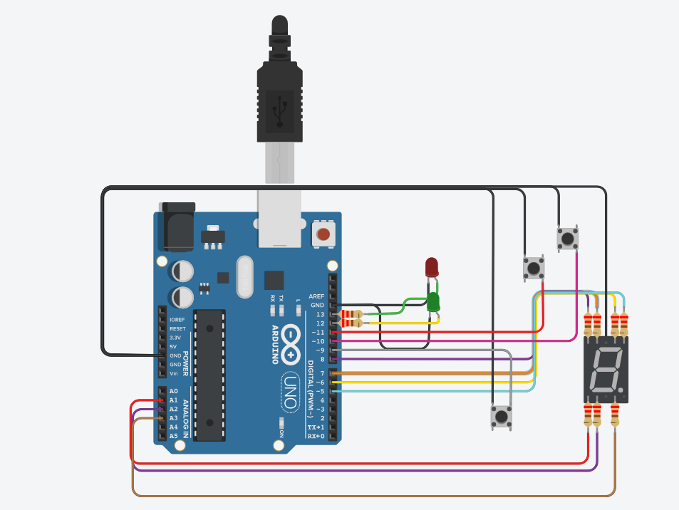
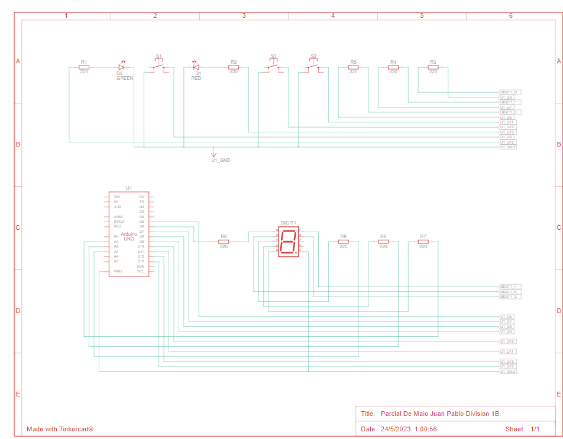

# parcial_SPD

## Integrantes 
- De Maio Juan Pablo

## parcial- montacargas.

## Descripción
es un ascensor, el cual sube, baja o frena, dependiendo el uso que le quiera dar a los botones(pulsadores)
## Diagrama Esquematico

los componentes utilizados en este diagrama son luces led, una roja, utilizada cuando el ascensor este quieto y la otra verde, cuando el ascensor este en movimiento, con resistencias de 220 omh.
luego tenemos el display 7 segmentos, conectado con resistencias de 220 omh, el cual nos permite ver que en piso del ascensor nos encontramos, por lo ultimo tenemos a los pulsadores(INPUT_PULLUP) que nos permiten decidir que hacer con el ascensor, si deseamos subir, bajar o frenar.

## Función principal
Esta funcion se encarga principalmente de subir, bajar o frenar el ascensor

leemos el estado de los pulsadores, los validamos, le damos un nuevo valor, que esto nos permitiria eliminar el antirebote.
luego esta el proceso de subir, el de bajar y el de frenar para que el ascensor pueda hacer lo que nosotros deseamos, despues validamos cuando esta quieto.

~~~ C 

void loop() {
  
  int botonSubir = digitalRead(BOTON_SUBIR);
  int botonBajar = digitalRead(BOTON_BAJAR);
  int botonFrenar = digitalRead(BOTON_FRENAR);

  if(botonSubir == LOW && botonsubirEstadoPrevio == HIGH)
  {
    botonSubirEstado = 1;
    botonBajarEstado = 0;
    botonFrenarEstado = 0;
  }
  
  if(botonBajar == LOW && botonBajarEstadoPrevio == HIGH)
  {
    botonBajarEstado = 1;
    botonSubirEstado = 0;
    botonFrenarEstado = 0;
  }
  
  if(botonFrenar == LOW && botonFrenarEstadoPrevio == HIGH)
  {
    botonFrenarEstado = 1;
    botonBajarEstado = 0;
    botonSubirEstado = 0;
  }
  
  botonFrenarEstadoPrevio = botonFrenar;
  botonBajarEstadoPrevio = botonBajar;
  botonsubirEstadoPrevio = botonSubir;
  
  if (botonSubirEstado == 1 && pisoActual <= 9)
  {
    encenderLed(LEDVERDE);
    apagarLed(LEDROJO);
    pisoActual++;
    mostrarPiso(pisoActual);
  }
  if (botonBajarEstado == 1 && pisoActual >= 0)  
  {
    encenderLed(LEDVERDE);
    apagarLed(LEDROJO);
    pisoActual--;
    mostrarPiso(pisoActual);
  }
  if (botonFrenarEstado == 1 && pisoActual >= 0) 
  {
    botonSubirEstado = 0 ;
    botonBajarEstado = 0;
    encenderLed(LEDROJO);
    apagarLed(LEDVERDE);
    mostrarPiso(pisoActual);
    Serial.println("el montacarga, se acaba de frenar en el piso:" + String(pisoActual)) ;
  }
  if (pisoActual == 0 || pisoActual == 9)
  {
    botonSubirEstado = 0 ;
    botonBajarEstado = 0;
    encenderLed(LEDROJO);
    apagarLed(LEDVERDE);
    mostrarPiso(pisoActual);
  }
 }
~~~

## :robot: Link al proyecto
- [proyecto](https://www.tinkercad.com/things/8IIVu2UY2rU-prueba-parcial/editel?sharecode=a6mOEN4_6KP9kSg6x8S9W73Jw8-SJ-kKn8C6jJNxLrY)

